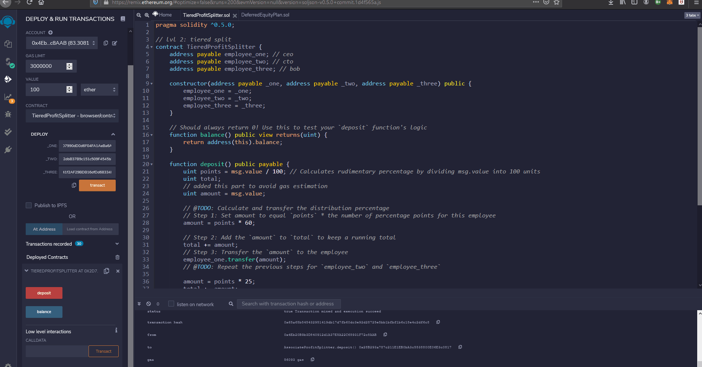

# Usage and Motivation

## Associate Profit Splitter

### Motivation:

The motivation and purpose of this contract is that it allows human resources departments or managers to quickly pay their employees using the ethereum blockchain. If you have three employees who recieve payments based on profit, the user can enter the profit left over and the addresses they wish to send to and quickly deposit the ethereum into their accounts.

### Usage:

1. First, the user must connect to the server they are trying to transact on. In this case we will be using metamask to connect with injected web3 while using our local host to send test ether as an example.

2. Next, the user must compile the file, then enter the addresses of the accounts they wish to transact with. Next the user must make sure the account on metamask is the account that will be sending the money. Make sure the initial value is set to 0 to avoid gas estimation errors. Finally, hit deploy and once the transaction appears on metamask hit confirm.

3. Now to send transactions, enter the value you wish to send in the value box and confirm its in the currency you wish to send. Hit deposit and confirm when prompted by meta mask. You can check your transaction by hitting the metamask confirmation prompt.

## Tiered Profit Splitter

## Motivation:

This contract acts like the last one however it splits the deposit into different tiers. For example, if you have a CEO, CTO and an employee. The CEO will get 60%, the CTO will get 25% and the employee will get 15%. 

### Usage:

1. Again, the user must connect to the server they are trying to transact on. In this case we will be using metamask to connect with injected web3 while using our local host to send test ether as an example.

2. Next, the user will have compile this file and enter the addresses of the accounts they wish to transact with. The first address entered will get 60%, the next will get 25% and the third will get 15%. Next the user must make sure the account on metamask is the account that will be sending the money. Make sure the initial value is set to 0 to avoid gas estimation errors. Finally, hit deploy and once the transaction appears on metamask hit confirm.

3. Too send transactions, enter the value you wish to send in the value box and confirm its in the currency you wish to send. Hit deposit and confirm when prompted by meta mask. You can check your transaction by hitting the metamask confirmation prompt.

## Deferred Equity Plan

### Motivation:

The motivation for this contract is that it handles a employees equity plan by distributing 250 shares over 4 years. This plan awards employees with 1000 shares for joining a company by depositing amounts of 250 per year over 4 yeears. However, if the employee doesnt stay in the company for the 4 years, he/she willl forfeit her remaining shares. This allows for management to provide incentive for employees to stay with them.

### Usage:

1. Once again, the user must connect to the server they are trying to transact on. In this case we will be using metamask to connect with injected web3 while using the ropstein testnet to send test ether as an example.

2. Next, the user will have to add the employees address that is recieving the shares and press deploy.

3. Since this is the start of employment, the user wont be able to distribute shares yet due to the contracts time lock but for the purpose of example, this contract has a built in function to fastforward 100 days per transaction.

4. To distribute and check shares already distributed you can select the functions distribute and distributed shares respectivly.

5. If the employee terminates their contract with the company. The user or employee can select the deactivate function which forfeits the rest of the shares.

## Notes:
- To test use the Ropstein testnet and input these addresses in the deploy section
- Associate Profit Splitter Testnet 0x41B0fC84D3ECD22Dd673BE47bc935583A402A0D0
- Tiered Profit Splitter Testnet 0x90089c651fC730277f15816c2c4C8E39D90D6423
- Deffered Equity Testnet 0x6eE35Ffcc1557863f0fbD4d15CDd2D3819E65d00
